# Dokumentasi: Pembuatan Tabel MySQL - Kelompok 1

## Mata Kuliah: Sistem Basis Data
**Dosen Pengampu:** Bapak Ahmad Anas, S.Kom., M.Kom.

## Deskripsi

Dokumentasi dari hasil kerja Kelompok 1 pada mata kuliah *Sistem Basis Data*, yang berfokus pada praktik pengelolaan data menggunakan query `SUM()`, `AVG()`, `ORDER BY`, dan `HAVING`.

---

## Daftar Anggota Kelompok 1

| Nama Lengkap                  | NIM        | Program Studi          |
|------------------------------|------------|------------------------|
| Febrian Eka Putra            | 24424020   | Teknik Informatika     |
| Zulfa Dwi Nugraha            | 244222013  | Manajemen Informatika  |
| Rizky Muhammad Nazwaril Ilham| 244242014  | Teknik Informatika     |
| Yuda Pratama                 | 244222008  | Teknik Informatika     |

## Kontribusi

### 1. Febrian Eka Putra
- Menyusun rancangan awal.
- Membuat query menggunakan `SUM()`, `AVG()`, `ORDER BY`, dan `HAVING` untuk menjawab soal.
- Memberikan instruksi teknis ke anggota.
- Membuat dokumentasi berupa *README.md*

### 2. Zulfa Dwi Nugraha
- Mencari dan mengumpulkan 20 data yang relevan dengan isi di dalam tugas.
- Menyiapkan data mentah agar siap di-`INSERT` oleh Rizky dan Yuda ke database.

### 3. Rizki Muhammad Nazwaril Ilham
- Membuat Database Kelompok 1.
- Menulis ulang query jawaban soal yang telah disiapkan Febrian.
- `INSERT` 10 data ke tabel query menggunakan MySQL.

### 4. Yudha Pratama
- Membuat tabel penjualan.
- Menulis ulang query jawaban soal yang telah disiapkan Febrian.
- `INSERT` 10 data ke tabel query menggunakan MySQL.

---

## Informasi Tugas Kelompok

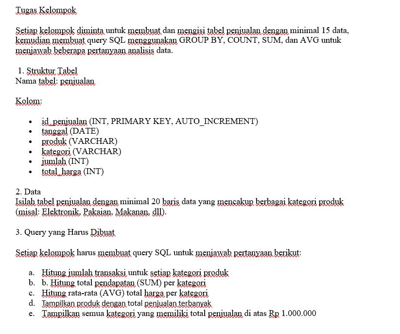

---

## 📸 Screenshot Query dan Penyelesaian Tugas ✅ 

### 📌 Jawaban No. 1 — Struktur Tabel

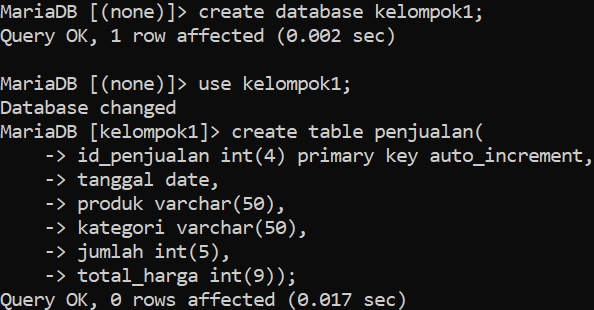

`CREATE DATABASE`, `USE` database yang dikerjakan oleh zulfa, dan `CREATE TABLE` yang dikerjakan oleh Rizky dan Yuda.

---

### 📌 Jawaban No. 2 — Input Data ke Tabel

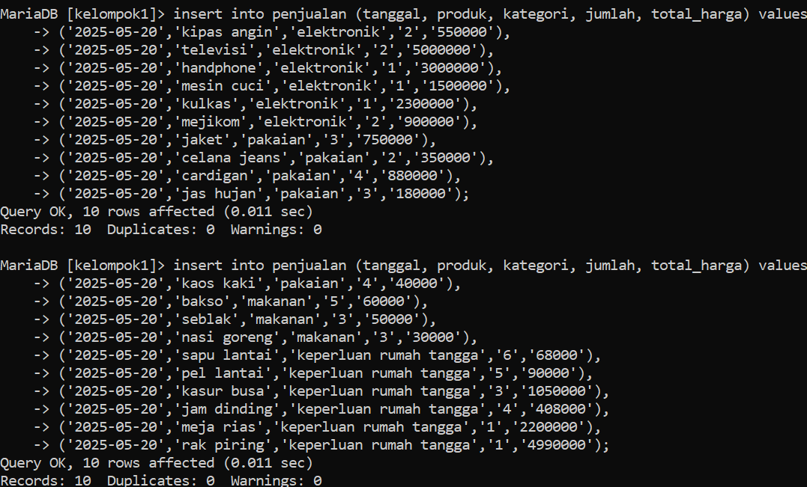

proses `INSERT` 20 data oleh Rizky dan Yuda dari data yang telah di riset oleh zulfa sebelumnya.

#### `select * from penjualan;`
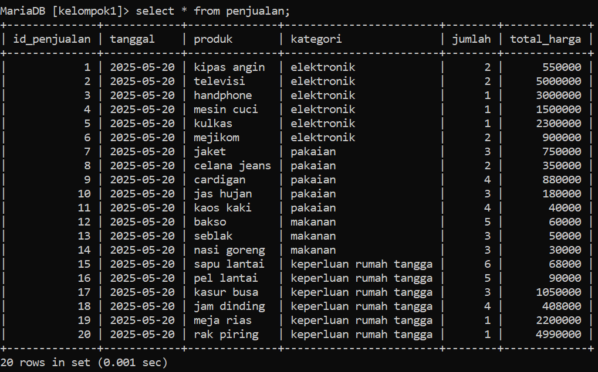

---

### 📌 Jawaban No. 3 — Query `SUM()`, `AVG()`, dll

#### a. Menghitung jumlah transaksi untuk setiap kategori produk menggunakan `SUM()`

- Jumlah Transaksi Elektronik

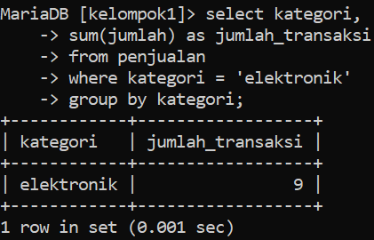

- Jumlah Transaksi Pakaian

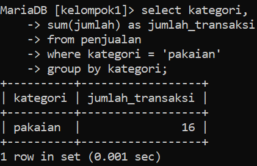

- Jumlah Transaksi Makanan

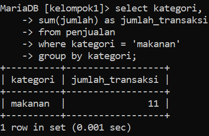

- Jumlah Transaksi Keperluan Rumah Tangga

---

#### b. Menghitung total pendapatan untuk setiap kategori produk

- Pendapatan Elektronik

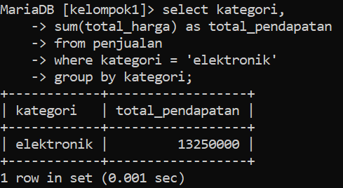

- Pendapatan Pakaian

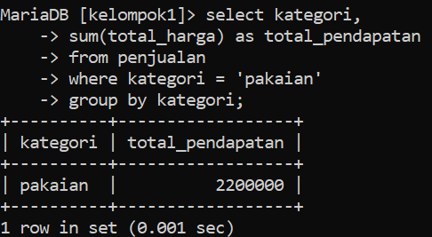

- Pendapatan Makanan

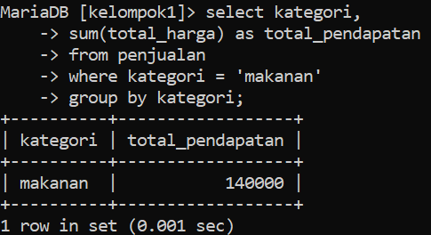

- Pendapatan Keperluan Rumah Tangga

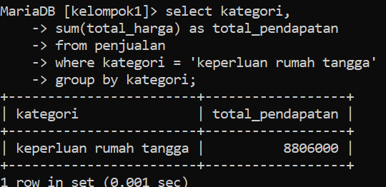

---

### c. Menghitung total harga rata-rata untuk setiap kategori

-  Total Harga Rata-rata Elektronik

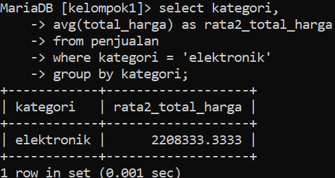

- Total Harga Rata-rata Pakaian

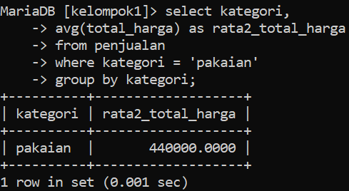

- Total Harga Rata-rata Makanan

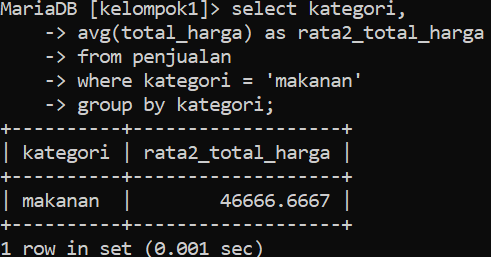

- Total Harga Rata-rata Keperluan Rumah Tangga

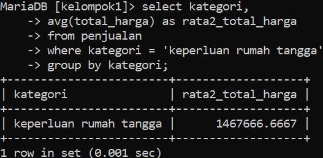

---

#### d. Menampilkan produk dengan total penjualan terbanyak

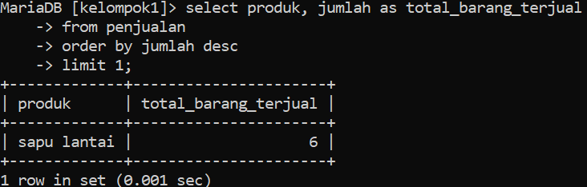

Produk “Sapu Lantai” menduduki posisi tertinggi penjualan.

---

### e. Menampilkan semua kategori dengan total penjualan diatas satu juta

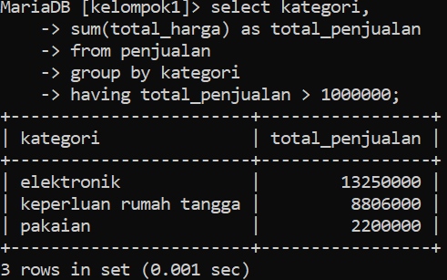

Tiga kategori memiliki penjualan di atas satu juta

---

## 🖼️ Dokumentasi Foto

#### Febrian memberikan intruksi ke setiap anggota
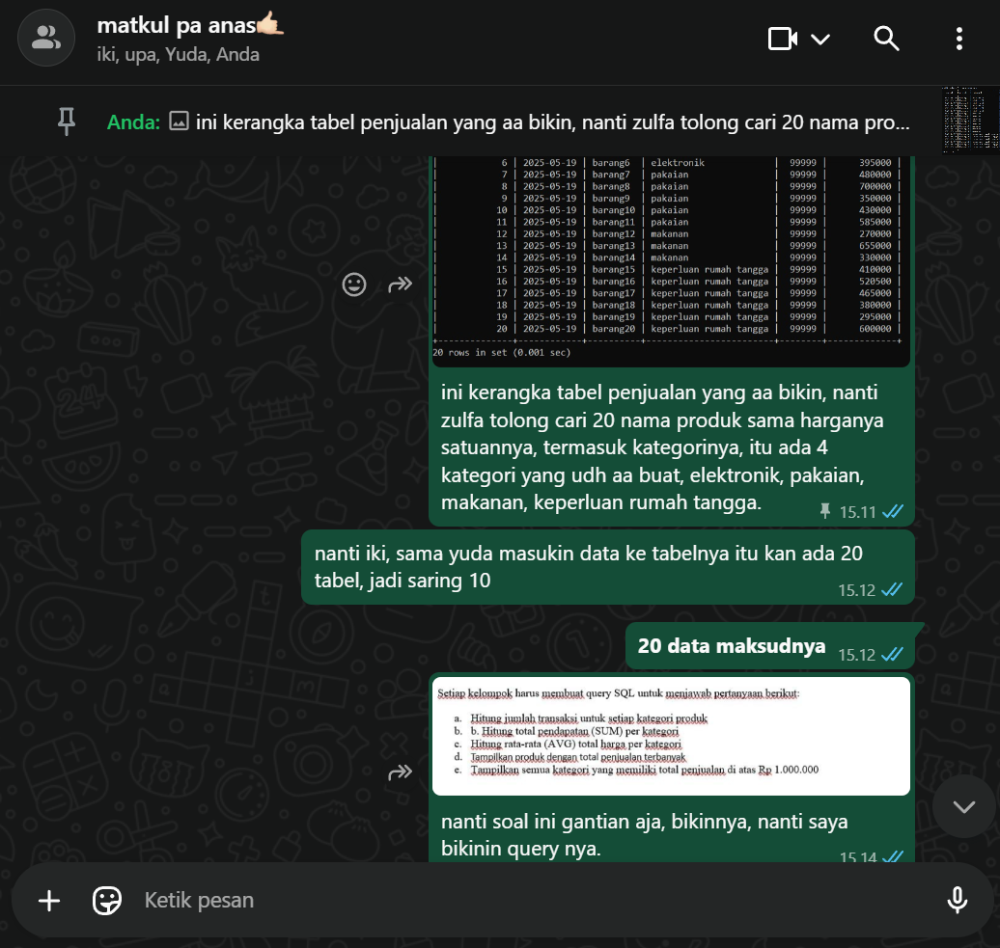

#### Zulfa meriset data lengkap dengan kategori jumlah dan total harganya

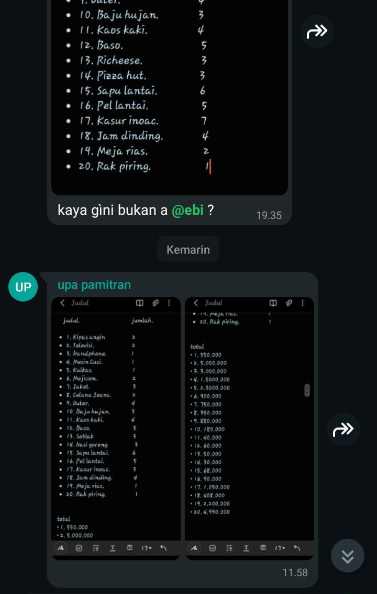

## comingsoon akan di update
