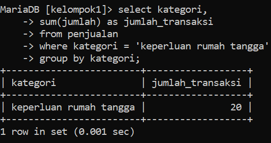

# Dokumentasi: Pembuatan Tabel MySQL - Kelompok 1

## Mata Kuliah: Sistem Basis Data
**Dosen Pengampu:** Bapak Ahmad Anas, S.Kom., M.Kom.

## Deskripsi

Dokumentasi dari hasil kerja Kelompok 1 pada mata kuliah *Sistem Basis Data*, yang berfokus pada praktik pengelolaan data menggunakan query `SUM()`, `AVG()`, `ORDER BY`, dan `HAVING`.

---

## Daftar Anggota Kelompok 1

| Nama Lengkap                  | NIM        | Program Studi          |
|------------------------------|------------|------------------------|
| Febrian Eka Putra            | 24424020   | Teknik Informatika     |
| Zulfa Dwi Nugraha            | 244222013  | Manajemen Informatika  |
| Rizky Muhammad Nazwaril Ilham| 244242014  | Teknik Informatika     |
| Yuda Pratama                 | 244222008  | Teknik Informatika     |

## Kontribusi

### 1. Febrian Eka Putra
- Menyusun rancangan awal.
- Membuat query menggunakan `SUM()`, `AVG()`, `ORDER BY`, dan `HAVING` untuk menjawab soal.
- Memberikan instruksi teknis ke anggota.
- Membuat dokumentasi berupa *README.md*

### 2. Zulfa Dwi Nugraha
- Mencari dan mengumpulkan 20 data yang relevan dengan isi di dalam tugas.
- Menyiapkan data mentah agar siap di-`insert` oleh Rizky dan Yuda ke database.

### 3. Rizki Muhammad Nazwaril Ilham
- Membuat Database Kelompok 1.
- Menulis ulang query jawaban soal yang telah disiapkan Febrian.
- `Insert` 10 data ke tabel query menggunakan MySQL.

### 4. Yudha Pratama
- Membuat tabel penjualan.
- Menulis ulang query jawaban soal yang telah disiapkan Febrian.
- `Insert` 10 data ke tabel query menggunakan MySQL.

---

## Informasi Tugas Kelompok

---

## Penyelesaian Tugas

Berikut dokumentasi proses dan hasil pengerjaan kelompok:

### 📸 Screenshot Query

#### Jawaban nomor 1 tentang struktur tabel ✅

`create database`, `use` database yang dikerjakan oleh zulfa, dan `create table` yang dikerjakan oleh Rizky dan Yuda.

#### Jawaban nomor 2 tentang memasukan data ke tabel ✅

proses `insert` 20 data oleh Rizky dan Yuda dari data yang telah di riset oleh zulfa sebelumnya.

`select * from penjualan;`

#### Jawaban nomor 3 tentang menjawab soal menggunakan query `SUM()`, `AVG()` dll ✅

- Menghitung jumlah transaksi untuk setiap kategori produk

Elektronik

Pakaian

Makanan

- Menghitung total pendapatan untuk setiap kategori produk

Elektronik

Pakaian

Makanan

Keperluan rumah tangga

- Menghitung rata-rata total harga untuk setiap kategori

Elektronik

Pakaian

Makanan

Keperluan rumah tangga

- Menampilkan produk dengan total penjualan terbanyak

Sapu lantai

- Menampilkan semua kategori dengan total penjualan diatas satu juta

3 kategori memiliki penjualan di atas 1 juta

## Foto Dokumentasi

#### Febrian memberikan intruksi ke setiap anggota

#### Zulfa meriset data lengkap dengan kategori jumlah dan total harganya

## comingsoon akan di update